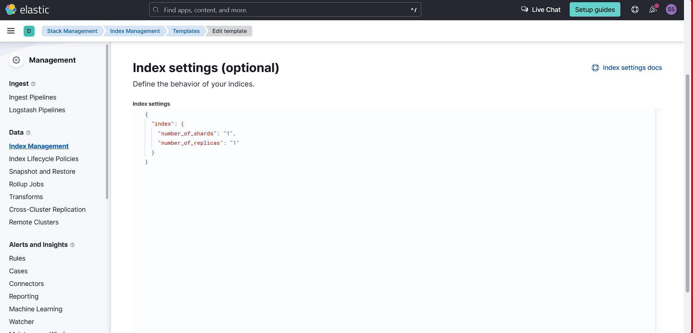
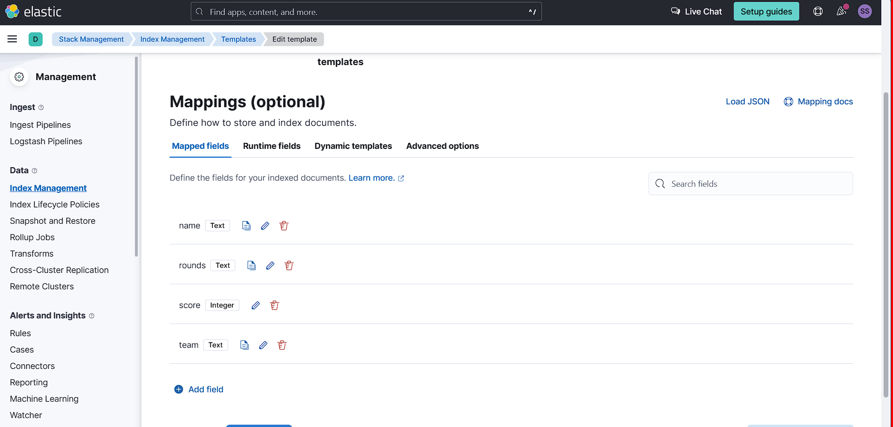

# flask-champion-league-team-search-app

----------------------
## Contents:
- [1. Overview](#1-overview)
- [2. Tech Stack](#2-tech-stack)
- [3. Models](#3-models)
- [4. REST API Structure](#4-rest-api-structure)
----------------------

## 1. Overview
The Python/Flask application is designed to provide a user-friendly interface to search and retrieve football score results for teams stored in Elasticsearch. The application utilizes the Flask framework for the web interface and Elasticsearch as the backend database to efficiently store and query football data.

Features:
1. Search Functionality:
Users can search for football score results using team names, match dates, or other relevant parameters.
Elasticsearch is leveraged for efficient and fast search queries.
2. Results Display:
Retrieved results are displayed in a user-friendly format on the web interface.
Information includes team names, match date, and final scores.

The application can be deployed on a web server or cloud platform, ensuring Elasticsearch is accessible.
By combining Python, Flask, and Elasticsearch, this application provides a powerful and efficient solution for searching and retrieving football score results, offering a seamless user experience for football enthusiasts and analysts alike.

## 2. Tech stack
The application will be developed using the following technologies:

- Backend (**Flask** - Python): 
    - the backend will be developed using the python's ***flask*** framework
- Frontend (**HTML**, **CSS**):
    - **HTML/CSS**: Form the structure and styling of your application.
- ElasticSearch for searching through the workouts at a great speed.

## 3. REST API Structure
The structure for the REST API interface required by our application to function will be the following:

| HTTP Method | Route                         | Description (Football Teams)                           |
|-------------|-------------------------------|--------------------------------------------------------|
| GET         | /api/teams                    | Get all teams (for admin or future expansion)          |
| POST        | /api/teams                    | Create a new team                                      |
| GET         | /api/team/{team_id}           | Get a specific football team by ID, and its data       |
| PUT         | /api/team/{team_id}           | Update football team details                           |
| DELETE      | /api/team/{team_id}           | Delete a football team                                 |

These routes assume a RESTful API structure where `/api/teams` handles team-related operations and `/api/team/{team_id}` manages endpoints for a specific team.

## 5. Elastic context

### 5.1. Index

### 5.2. Index Mapping

